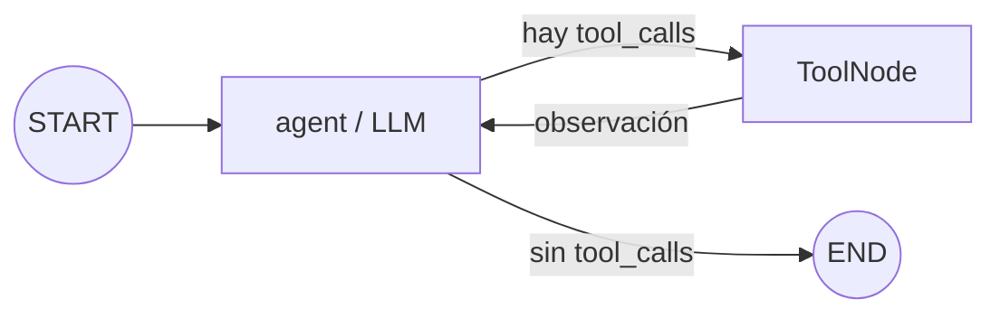

# Pre-entrega 5 — Agente ReAct con memoria persistente

Proyecto en Python 3.12 que implementa un agente asíncrono con LangGraph. El agente decide
por sí mismo cuándo consultar una herramienta, puede recorrer el ciclo
`agente → herramienta → agente` varias veces y conserva la conversación en SQLite mediante
un `thread_id`.

## Qué demuestra

- **Tool Calling seguro:** `SearchInput` valida `query` y `limit` con Pydantic.
- **Autonomía:** el modelo elige si necesita `search_knowledge_base`; no hay rutas manuales
  basadas en el texto del usuario.
- **Ciclo ReAct:** `tools_condition` devuelve el flujo a la herramienta o finaliza el grafo.
- **Razonamiento multi-paso:** la primera pregunta necesita dos búsquedas independientes;
  con `bind_tools(..., parallel_tool_calls=False)`, cada búsqueda ocurre en su propio ciclo.
- **Persistencia:** `AsyncSqliteSaver` conserva checkpoints en un archivo SQLite.
- **Memoria:** una segunda pregunta ambigua recuerda al cliente 102 porque usa el mismo
  `thread_id`.
- **Resiliencia:** los timeouts y fallos de conexión se convierten en resultados controlados.
- **Seguridad de costos:** cada ejecución usa `recursion_limit=10`.
- **Trazabilidad:** el historial ReAct se guarda como JSON dentro de `traces/`.

## Material de estudio y revisión

- **[Resumen visual del módulo 5](docs/resumen-modulo-5.html):** HTML autocontenido con grafos,
  Tool Calling, ReAct, checkpoints, errores, checklist y glosario.
- **[Master prompt para Claude Code](MASTER_PROMPT_CLAUDE_CODE.md):** instrucciones completas para
  auditar el código, ejecutar pruebas, puntuar la entrega y corregir únicamente problemas reales.

## Arquitectura



El estado hereda de `MessagesState`. Esa clase ya contiene:

```python
messages: Annotated[list[BaseMessage], add_messages]
```

`add_messages` es el *reducer*: cuando un nodo devuelve un mensaje nuevo, LangGraph lo agrega
al historial en vez de reemplazar los mensajes anteriores.

## Flujo de la demostración

1. El usuario pregunta: **“¿Cuántos pedidos tiene el cliente 102 y cuál es el total?”**
2. El LLM decide buscar la cantidad de pedidos.
3. `ToolNode` ejecuta la herramienta y devuelve la observación.
4. El flujo regresa al LLM. Como todavía falta el total, decide hacer otra búsqueda.
5. Con ambas observaciones, el LLM responde y el grafo llega a `END`.
6. Con el mismo `thread_id`, el usuario pregunta: **“¿Y cuál fue el último?”**
7. El checkpoint recupera el historial; el agente sabe que se habla del cliente 102.

La aplicación no contiene un `if pregunta == ...`. El LLM toma las decisiones mediante Tool
Calling y la arista condicional `tools_condition` interpreta esas decisiones.

## Estructura

```text
langgraph-react-agent/
├── src/react_agent/
│   ├── config.py       # Variables de entorno validadas
│   ├── graph.py        # Estado, nodos, aristas y compilación
│   ├── main.py         # Demostración asíncrona de dos turnos
│   ├── tools.py        # Pydantic, @tool y base simulada
│   └── tracing.py      # Exportación de la traza ReAct
├── tests/
│   ├── conftest.py     # ScriptedModel: LLM determinista para tests
│   ├── test_graph.py   # Dos ciclos, memoria, errores y recursion_limit
│   ├── test_main.py    # Demo completa sin red
│   └── test_tools.py   # Validación y errores controlados
├── traces/
│   ├── example_trace.json   # Ejemplo ilustrativo del formato
│   └── real_run_trace.json  # Ejecución real con gpt-4.1-mini
├── docs/
│   └── resumen-modulo-5.html
├── MASTER_PROMPT_CLAUDE_CODE.md
├── .env.example
├── .gitignore
├── pyproject.toml
└── README.md
```

## Requisitos

- Python 3.12 o 3.13.
- Una API key de OpenAI.
- Git, si querés clonar o versionar el proyecto.

## Instalación paso a paso

Desde la carpeta del proyecto:

```bash
python3.12 -m venv .venv
source .venv/bin/activate
python -m pip install --upgrade pip
python -m pip install -e ".[dev]"
```

En Windows, la activación cambia por:

```powershell
.venv\Scripts\activate
```

## Variables de entorno

Creá tu archivo local a partir del ejemplo:

```bash
cp .env.example .env
```

Después editá `.env`:

```dotenv
OPENAI_API_KEY=replace_with_your_openai_api_key
OPENAI_MODEL=gpt-4.1-mini
CHECKPOINT_DB_PATH=data/checkpoints.sqlite
TRACE_OUTPUT_PATH=traces/latest_trace.json
THREAD_ID=cliente-102-demo
```

`.env` está ignorado por Git. Nunca subas una API key al repositorio.

## Cómo ejecutar

```bash
python -m react_agent.main
```

También se instala un comando equivalente:

```bash
react-agent
```

Al finalizar se crean dos archivos locales:

- `data/checkpoints.sqlite`: memoria persistente del grafo.
- `traces/latest_trace.json`: traza real de la última ejecución.

Si volvés a ejecutar con el mismo `THREAD_ID`, el checkpoint acumula el historial, pero la
consola y `latest_trace.json` muestran solo la ejecución actual. Para comenzar una conversación
diferente, cambiá `THREAD_ID`. Para repetir la demostración
desde cero con el mismo identificador, borrá `data/checkpoints.sqlite` con el programa cerrado.

## Cómo ejecutar las pruebas

```bash
pytest -q
ruff check .
mypy src/react_agent
```

Las pruebas no usan una API key ni consumen tokens. `ScriptedModel` (en `tests/conftest.py`)
reemplaza al LLM con decisiones fijas y permite verificar:

- la secuencia exacta `tool_call → observación → tool_call → observación → respuesta`;
- que la segunda pregunta ambigua se resuelve con el historial recuperado de SQLite, incluso
  reabriendo la conexión, y que otro `thread_id` no comparte memoria;
- que `ToolNode` convierte argumentos inválidos en una observación de error;
- que `recursion_limit` corta un agente que nunca termina;
- la demo completa de `main.py` ejecutada dos veces, sin filtrar la API key.

## Las piezas importantes, explicadas para principiantes

### 1. El contrato Pydantic

```python
class SearchInput(BaseModel):
    query: str = Field(min_length=3, max_length=200, description=...)
    limit: int = Field(default=1, ge=1, le=3, description=...)
```

Este esquema funciona como un control de acceso a la herramienta. Antes de ejecutar la
búsqueda, Pydantic comprueba que `query` tenga entre 3 y 200 caracteres y que `limit` esté
entre 1 y 3.

### 2. La herramienta asíncrona

```python
@tool(args_schema=SearchInput)
async def search_knowledge_base(query: str, limit: int = 1) -> str:
    ...
```

El decorador convierte la función en una herramienta que el LLM conoce. El `docstring` es
parte del contrato: le explica cuándo usarla. `async def` permite esperar I/O sin bloquear el
event loop.

### 3. El estado acumulativo

```python
class AgentState(MessagesState):
    pass
```

`MessagesState` ya incorpora el historial y el reducer `add_messages`. Por eso cada
observación de una herramienta queda disponible para la siguiente decisión del agente.

### 4. La arista condicional

```python
workflow.add_conditional_edges("agent", tools_condition)
```

Si la respuesta del LLM contiene `tool_calls`, el flujo va a `tools`. Si contiene una respuesta
normal, termina. Esa es la decisión autónoma del agente.

### 5. El ciclo

```python
workflow.add_edge("tools", "agent")
```

Después de ejecutar la herramienta, LangGraph vuelve al modelo. El modelo observa el resultado
y decide si responde, reintenta o usa otra herramienta.

### 6. El checkpoint

```python
async with AsyncSqliteSaver.from_conn_string("data/checkpoints.sqlite") as checkpointer:
    app = workflow.compile(checkpointer=checkpointer)
```

SQLite guarda una fotografía del estado después de cada paso. El `thread_id` identifica qué
historial debe recuperar. Se usa `AsyncSqliteSaver` porque es la variante asíncrona oficial de
`SqliteSaver`, adecuada para este proyecto con `ainvoke`.

## Manejo de errores

La herramienta captura errores de infraestructura esperables:

```python
except (TimeoutError, ConnectionError) as exc:
    return '{"status": "error", ...}'
```

El proceso no se cae. El error vuelve al LLM como una observación y el prompt le indica que
reintente una sola vez o explique el problema. Además, `ToolNode(..., handle_tool_errors=True)`
transforma errores de ejecución de herramientas en mensajes que el agente puede observar.

## Trazas

[`traces/example_trace.json`](traces/example_trace.json) muestra el formato incluido en el
repositorio con el mismo formato que genera `save_trace()`. Al ejecutar el programa se genera `traces/latest_trace.json` con eventos reales:

- `user_input`: mensaje del usuario.
- `reason_and_tool_call`: decisión estructurada del modelo.
- `tool_observation`: resultado local de la herramienta.
- `final_answer`: respuesta final del agente.

[`traces/real_run_trace.json`](traces/real_run_trace.json) es una ejecución real con
`gpt-4.1-mini` y la base vacía: el agente hizo dos búsquedas secuenciales (cantidad y total)
antes de responder la primera pregunta y, con el mismo `thread_id`, resolvió “¿Y cuál fue el
último?” como una pregunta sobre el cliente 102.

No se guarda el razonamiento privado del modelo. La traza registra decisiones observables,
argumentos, resultados y respuestas, que es lo necesario para auditar el flujo.

## Checklist de la consigna

- [x] Python 3.12+ y entorno virtual documentado.
- [x] `StateGraph` con estado que hereda de `MessagesState`.
- [x] Nodo del modelo y `ToolNode`.
- [x] Arista condicional mediante `tools_condition`.
- [x] Herramienta propia con `@tool`, Pydantic y docstring descriptivo.
- [x] LLM vinculado con `bind_tools()`.
- [x] Persistencia SQLite y sesiones mediante `thread_id`.
- [x] Invocación asíncrona con `ainvoke`.
- [x] Prueba multi-paso con dos llamadas de herramienta.
- [x] Prueba de memoria: segunda pregunta ambigua con el mismo `thread_id`.
- [x] Errores de herramienta convertidos en observaciones (timeout, conexión, validación).
- [x] `recursion_limit` para evitar ciclos infinitos.
- [x] Traza de ejemplo y traza de una ejecución real en JSON.
- [x] API keys excluidas del repositorio.

## Nota sobre producción

La base vectorial de esta entrega es simulada para que el foco esté en LangGraph. En producción
se reemplazaría `MockVectorDB` por un cliente real. SQLite es apropiado para desarrollo local;
para múltiples procesos o alta concurrencia conviene un checkpointer de PostgreSQL.
